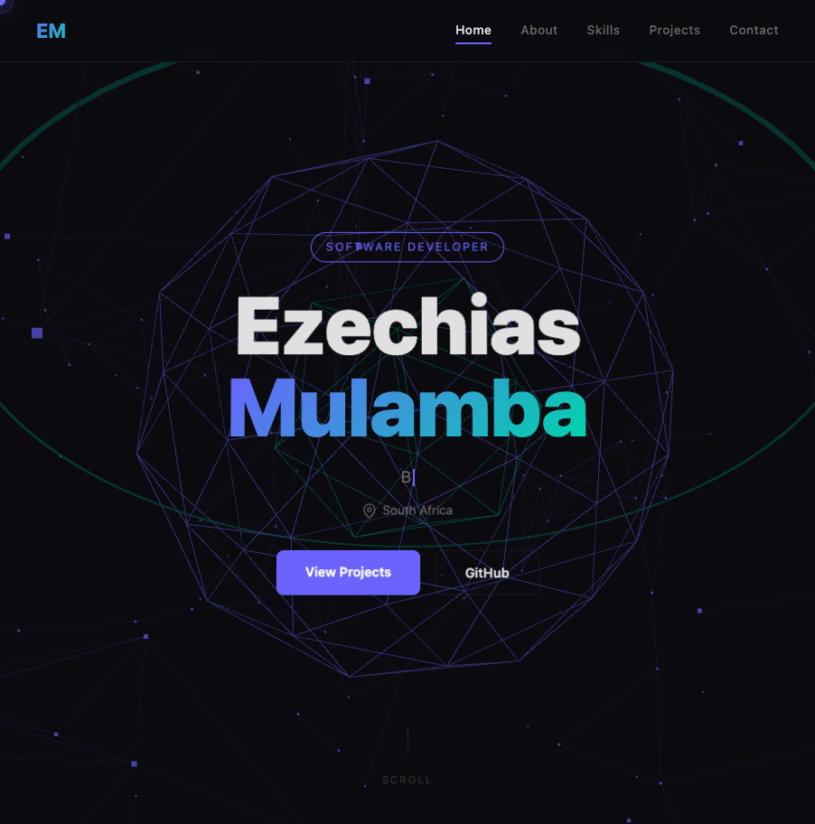
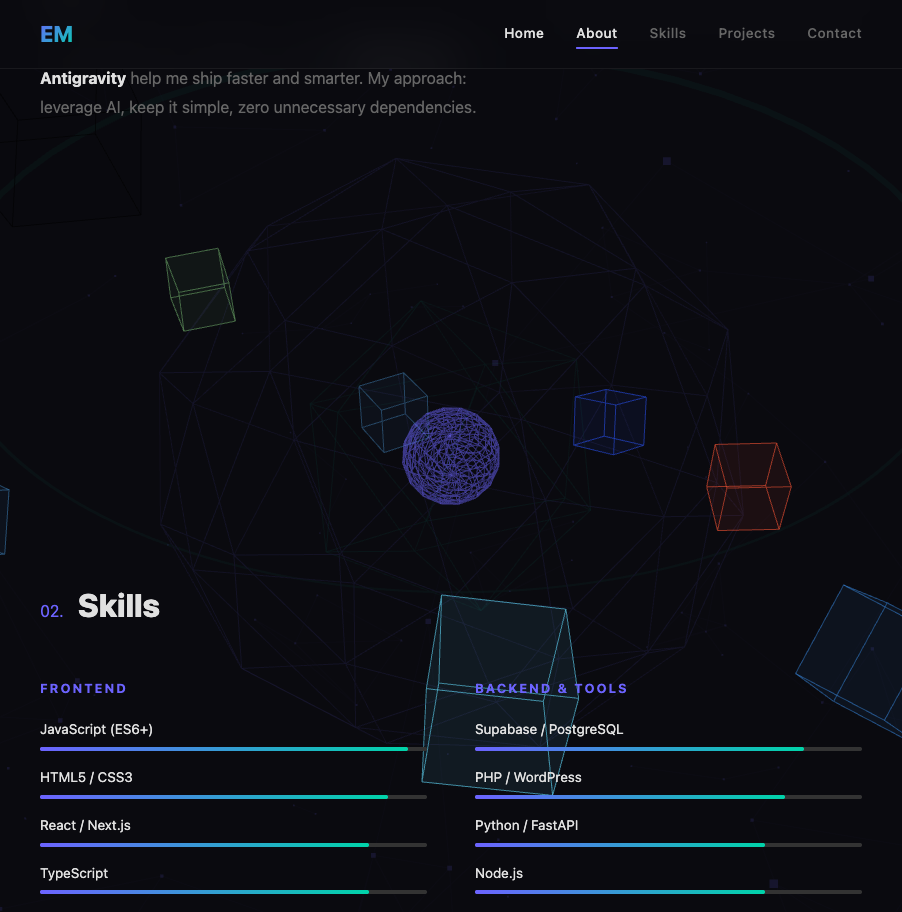
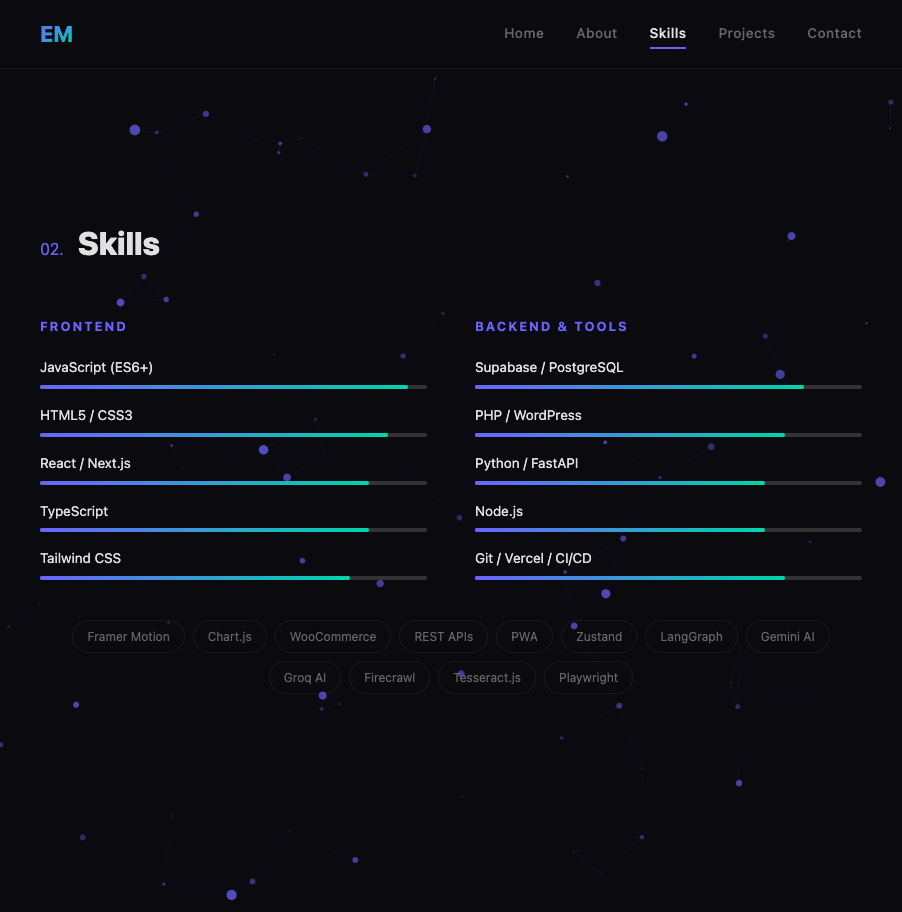
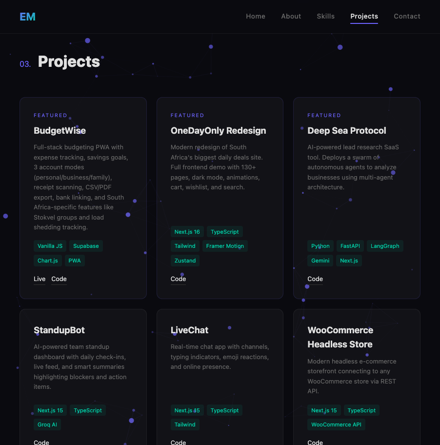
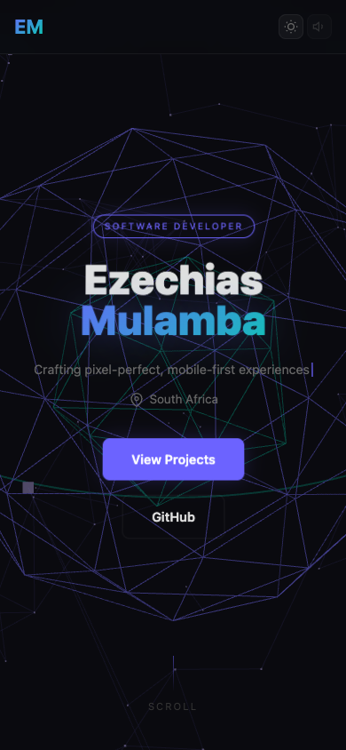
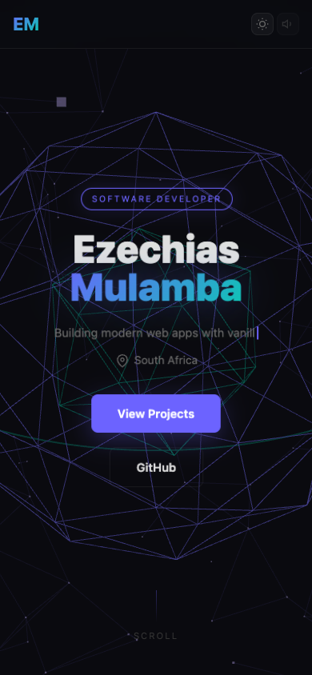

# 3D Interactive Resume

An interactive 3D resume showcasing my skills, projects, and experience as a full-stack developer. Built with vanilla JavaScript, HTML5, and CSS3.

## Live Demo

**[View Live](https://3d-resume-eight.vercel.app/)**

## Features

- Interactive 3D geometric hero animation
- Dark theme with theme toggle
- Sound effects toggle
- Animated skill bars with percentage indicators
- Project showcase with live demo links
- Fully responsive (desktop + mobile)
- Smooth scroll navigation
- Contact section with social links

## Screenshots

| Desktop Hero | Skills Section | Projects |
|---|---|---|
|  |  |  |

| Mobile Hero | Mobile Projects |
|---|---|
|  |  |

## Tech Stack

- **Vanilla JavaScript** (ES6+)
- **HTML5** / **CSS3**
- Custom 3D canvas animations
- No frameworks, no dependencies

## Author

**Ezechias Mulamba** — [GitHub](https://github.com/ezechias1) | [LinkedIn](https://www.linkedin.com/in/ezechias-mulamba-b12276283/)
